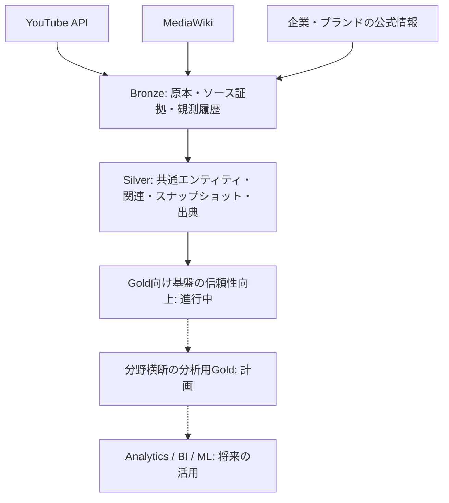

# Contents Lakehouse

[日本語](README.md) | [English](README_EN.md)

**コンテンツ産業の異種データを、履歴と根拠を保持してつなぐデータ基盤。**

## プロジェクト概要

アーティスト情報、動画、視聴反応、広告・商業活動の情報は、APIやWebページなどに分散しています。Contents Lakehouseは、これらを収集・保存・正規化し、共通のIDと関連テーブルで結び付けるデータエンジニアリングのポートフォリオです。

設計・実装の中心は、**Bronzeでの原本・履歴保存、Silverのエンティティモデリング、時系列スナップショット、出典管理、再実行時の整合性**です。Python、Apache Spark、Apache Icebergを用いたローカル基盤に、GCSへの収集経路を追加しています。現在は分析機能の拡張よりも、Bronze/Silverの信頼性向上を優先しています。

## 解決したいデータの課題

同じアーティストでもソースごとに名称や識別子が異なり、動画の累積指標やWebページの内容は更新されます。最新値だけの保存や名称による結合では、過去の状態や情報の根拠を確認しにくくなります。また、公開日・観測日時・活動の実施日は、それぞれ異なる意味を持ちます。

```text
アーティストの活動 → コンテンツ → 視聴者の反応 → 商業・広告活動
```

この流れはデータを関連付けて捉えるための概念図であり、因果関係を表すものではありません。将来、活動前後の指標変化やアーティストとブランドの関係を調べるために、まず事実・時点・出典を追跡できる基盤を整えます。

## アーキテクチャ



**ローカル処理:** MinIOにソースデータを保存し、Docker Compose上の単発SparkジョブでIcebergテーブルへ変換します。DuckDBはローカル分析用のクエリエンジンとして位置付けています。

**クラウド収集:** YouTubeとMediaWikiのCloud Run JobからGCS Bronzeへの保存を実装し、動作確認済みです。YouTubeはCloud Schedulerによる毎時実行も確認済みです。AdvertisingのCloud Scheduler稼働は確認済みの範囲に含めていません。収集と変換処理は分離しており、Spark/IcebergによるSilver/Gold処理はGCP上では稼働していません。クラウド処理への全面移行は未完了です。

詳細は[アーキテクチャ](docs/ARCHITECTURE.md)を参照してください。

## Engineering Highlights — 設計・実装の要点

| 観点 | 実装内容 |
| --- | --- |
| 原本の保存 | Bronzeにソースデータを保存し、後続の変換や出典確認に利用。広告データの観測履歴の拡充はFoundation Hardeningで対応中。 |
| 時系列・時間の意味 | YouTubeの指標を動画ID × 観測日時で保持。公開日時と観測日時、日付精度と時刻精度を区別。 |
| データモデリング | 共通エンティティ、決定的ID、関連テーブル、IcebergのMERGEキーを設計。判明していない値はNULLまたは未解決として扱う。 |
| 証拠と来歴 | MediaWikiのリビジョン来歴、広告のソース証拠・項目別根拠を保持。ニュースによる発見候補と公式の商業関係を分離。 |
| データ品質の検証 | 重複、参照、日付などを対象に検証と回帰テストを実装。YouTubeの収集障害の分離はFoundation Hardeningで対応中。 |
| 段階的なクラウド対応 | MinIO/GCSの保存先を切り替える抽象化と収集専用ジョブを実装。既存のソース契約を維持して実行環境を拡張。 |

履歴の再処理に必要な原本は保持しますが、訂正データの反映、Silverの来歴永続化、復旧管理には継続課題があります。冪等性は既存キーでの再実行を対象としており、すべての訂正・再処理が解決済みという意味ではありません。

## 現在のデータドメイン

| ドメイン | 実装済みの範囲と制約 |
| --- | --- |
| YouTube | 指定チャンネルのアップロード探索、動画メタデータ、再生・高評価・コメント数の観測スナップショット、API応答のBronze保存、Silver変換。時間単位の収集を想定し、実際の観測日時を保持。 |
| MediaWiki / Artist | RESCENEとメンバーの共通ID、所属関係、対応する形式のリリース情報、ページ・リビジョン来歴。日付のみのイベントは精度を明示。汎用的な人物・イベント抽出ではない。 |
| Advertising | 組織・ブランド・キャンペーン・商品・クリエイティブ・市場のモデルと、アーティスト参加・証拠の関連。公開日と有効期間を分離。収集パイプラインは指定のNarangd公式ページが対象で、追加の公式情報アダプターはfixtureで検証。全モデルに実データが揃っているわけではない。 |
| Artist Activity Timeline | 動画公開、アーティストイベント、明示されたキャンペーン日付・公式証拠の公開日を共通形式へ投影。時間精度と決定的なイベントIDを保持。変換・永続化コードは実装済みで、定期パイプラインへの組み込みは未実施。 |

テーブルの粒度・キー・関連は[データモデル](docs/DATA_MODEL.md)に記載しています。

## 初期検証対象 — RESCENE

初期MVPではK-popグループの**RESCENE**を対象とし、複数ソースを結び付ける設計を、範囲を絞って検証しています。対象の拡大よりも、履歴とドメイン間の関連を正しく扱えることを優先しています。

YouTubeの起点は`@RESCENE_official`と`@helloiamwoninicetomeetyou`です。後者は関連チャンネルとして扱い、公式チャンネルとは判定していません。

## 現在のステータス

| 区分 | 状況 |
| --- | --- |
| 実装済み | ローカル基盤、上記ドメインの収集・変換・モデル。YouTube・MediaWikiのCloud Run Job → GCS Bronzeと、YouTubeのCloud Schedulerによる毎時実行を動作確認済み。 |
| 進行中 | Foundation Hardening Phase 1は未完了。広告の不変コンテンツと観測履歴の分離によるA → B → A対応、YouTubeの動画・バッチ・チャンネル単位の障害分離、およびPhase 1の回帰検証に取り組む。Bronze/Silverの訂正・再処理時の整合性、来歴、復旧、データ品質の改善とクラウド処理の拡張も継続。 |
| 計画 | 分野横断の分析用Gold（M05）、BI/MLへの活用、負荷・コスト評価。**M05は残る基盤課題の解消まで保留。** |

既存のYouTube時間別・24時間増分の変換コードはありますが、分野横断の分析用Goldが完成した状態ではありません。実装マイルストーンは[ロードマップ](docs/ROADMAP.md)、設計判断は[ADR](docs/adr/)にまとめています。

## 技術スタック

| 用途 | 技術 |
| --- | --- |
| 収集・変換・検証 | Python、SQL、unittest |
| ローカル保存・テーブル・処理 | MinIO、Apache Iceberg、Apache Spark |
| 分析用クエリ層 | DuckDB（アーキテクチャ上の位置付け。現行のデータ確認スクリプトはSparkを使用） |
| 実行環境 | Docker / Docker Compose、Cloud Run Jobs向け収集コンテナ |
| クラウド保存 | Google Cloud Storage、Application Default Credentials |

## 将来の分析への活用

基盤の信頼性と必要な関連データを整備した後、次の活用を想定しています。

- コンテンツの成長や、活動・リリース前後のエンゲージメント変化の比較
- アーティスト × ブランド・商品の商業関係の整理
- 公開された表記や公式証拠に基づくスポンサー・商業コンテンツの分析
- コンテンツ／マーケティング業務向けのBIや分析データセット

これらは将来の分析拡張です。広告の因果効果、収益推定、視聴者属性の取得・分析は実装成果に含めていません。

## ドキュメント・リポジトリガイド

- [アーキテクチャ](docs/ARCHITECTURE.md) / [データモデル](docs/DATA_MODEL.md) — レイヤーの責務とデータ契約
- [ロードマップ](docs/ROADMAP.md) / [実装レポート](docs/reports/) / [ADR](docs/adr/) — 開発範囲、検証、設計判断
- [広告ソースの実現性・制約](docs/ADVERTISING_SOURCE_FEASIBILITY.md) — ソースの役割と利用上の制約
- [src/](src/) / [tests/](tests/) — 収集・変換・永続化と回帰テスト
- [infra/](infra/) / [scripts/](scripts/) — コンテナ定義とローカル実行用ラッパー

運用は単発ジョブの実行を基本とします。ローカルの定期起動はホスト側スケジューラーで別途設定し、収集専用ジョブでは保存先をMinIO/GCSから選択します。実行時の環境変数は[設定例](.env.example)、処理の境界は[アーキテクチャ](docs/ARCHITECTURE.md)を参照してください。
