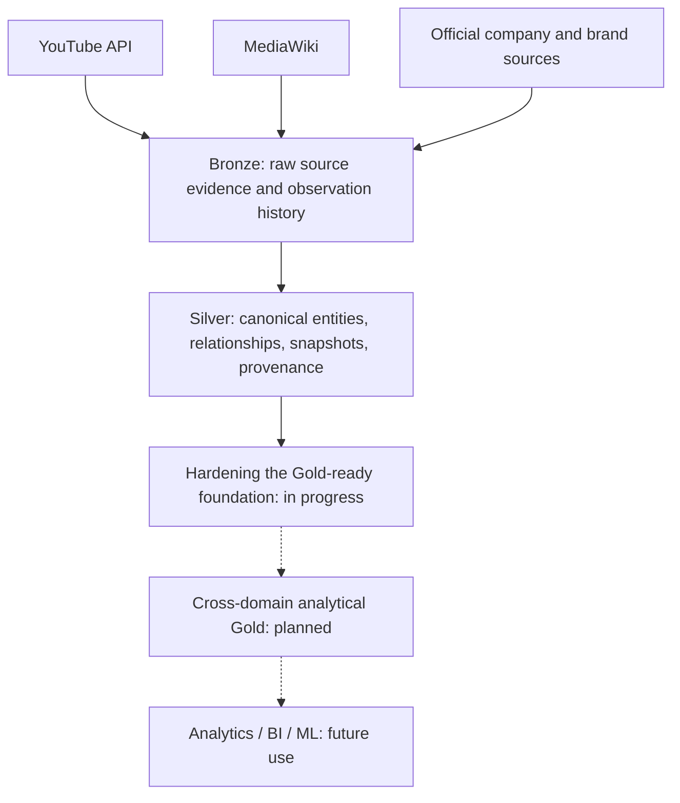

# Contents Lakehouse

[日本語](README.md) | [English](README_EN.md)

**A data foundation that connects heterogeneous content-industry data while preserving its history and evidence.**

## Project overview

Artist information, videos, audience engagement, and commercial activity are scattered across APIs and web pages. Contents Lakehouse is a data engineering portfolio project that collects, preserves, normalizes, and connects these facts through canonical IDs and relationship tables.

The design and implementation focus on **Bronze source/history preservation, canonical Silver modeling, time-series snapshots, provenance, and repeatable processing**. A local Python, Apache Spark, and Apache Iceberg stack is extended with GCS collection. The current priority is Bronze/Silver reliability before expanding analytics.

## The data problem

Names and identifiers differ across sources; cumulative video metrics and page contents change over time. Keeping only the latest values or joining by display names makes historical states and supporting evidence difficult to verify. Publication time, observation time, and an activity's effective date also mean different things.

```text
Artist Activity → Content → Audience Engagement → Commercial / Advertising Activity
```

This is a conceptual relationship between data domains, not a causal chain. Comparing engagement around releases or examining artist–brand relationships first requires traceable facts, times, and sources.

## Architecture



**Local processing:** MinIO stores source data; finite Spark jobs in Docker Compose transform it into Iceberg tables. DuckDB is the architectural query layer for local analysis.

**Cloud collection:** YouTube and MediaWiki Cloud Run Jobs writing to GCS Bronze are implemented and verified. Hourly YouTube execution through Cloud Scheduler is also verified. Active Advertising Cloud Scheduler execution is not part of the verified scope. Collection remains separate from processing: Spark/Iceberg Silver/Gold processing does not run on GCP, and full cloud processing migration is incomplete.

See the [architecture](docs/ARCHITECTURE.md) for implementation boundaries.

## Engineering highlights

| Area | Implemented work |
| --- | --- |
| Source preservation | Retain source data in Bronze for downstream transformation and evidence inspection. Extending Advertising observation history is Foundation Hardening work in progress. |
| Time-series and temporal semantics | Store YouTube metrics by video ID × observation time. Distinguish publication from observation and date precision from timestamp precision. |
| Data modeling | Design canonical entities, deterministic IDs, relationship tables, and Iceberg MERGE keys. Keep unavailable values null or unresolved. |
| Evidence and lineage | Preserve MediaWiki revision lineage and Advertising source/field evidence. Separate discovery news from verified commercial relationships. |
| Data-quality validation | Implement duplicate, reference, and date checks with regression tests. YouTube collection failure isolation is Foundation Hardening work in progress. |
| Incremental cloud adoption | Switch MinIO/GCS storage through an adapter and use collection-only jobs while retaining existing source contracts. |

Retained source data supports replay, but correction handling, persisted Silver lineage, and recovery tracking still need hardening. Idempotency at established keys does not mean every correction or replay scenario is resolved.

## Current data domains

| Domain | Implemented coverage and limits |
| --- | --- |
| YouTube | Upload discovery for configured channels, video metadata, view/like/comment snapshots, raw API Bronze capture, and canonical Silver transformation. Designed for hourly invocation while retaining actual observation timestamps. |
| MediaWiki / Artist | Canonical RESCENE/member IDs, membership relationships, supported release rows, and page/revision lineage. Date-only events retain explicit precision. This is not generalized person/event extraction. |
| Advertising | Organization, brand, campaign, product, creative, and market models; artist participation and evidence relationships; separate publication and effective dates. The collection pipeline targets a configured Narangd official page; additional official adapters are fixture-tested. Not every modeled entity has populated source data. |
| Artist Activity Timeline | A common projection for video publication, artist events, explicit campaign dates, and official-evidence publication, with temporal precision and deterministic event IDs. Transformation and persistence code exist; scheduled pipeline integration is pending. |

See the [data model](docs/DATA_MODEL.md) for grains, keys, and relationships.

## Initial validation target — RESCENE

The MVP uses **RESCENE**, a K-pop group, to validate the platform across sources within a deliberately bounded scope. Historical correctness and domain relationships take priority over collecting more artists.

YouTube collection starts from `@RESCENE_official` and `@helloiamwoninicetomeetyou`. The latter is treated as a related seed channel, not an official channel.

## Current status

| Status | Scope |
| --- | --- |
| Implemented | Local foundation and domain collection/transformation/modeling described above. Verified YouTube and MediaWiki Cloud Run Jobs → GCS Bronze, plus hourly YouTube execution through Cloud Scheduler. |
| In progress | Foundation Hardening Phase 1 is not complete: separating immutable Advertising content from observation history for A → B → A handling, isolating YouTube video/batch/channel failures, and Phase 1 regression validation. Broader Bronze/Silver correction and replay correctness, lineage, recovery, data quality, and cloud processing expansion remain ongoing. |
| Planned | Cross-domain analytical Gold (M05), BI/ML use, and load/cost evaluation. **M05 remains blocked pending the remaining foundation corrections.** |

Existing YouTube hourly and 24-hour growth transformations do not represent a completed cross-domain analytical Gold layer. Milestones are documented in the [roadmap](docs/ROADMAP.md), with design decisions in [ADRs](docs/adr/).

## Technology stack

| Responsibility | Technology |
| --- | --- |
| Collection, transformation, validation | Python, SQL, unittest |
| Local storage, tables, processing | MinIO, Apache Iceberg, Apache Spark |
| Analytical query layer | DuckDB in the architecture; current data-inspection scripts use Spark |
| Execution | Docker / Docker Compose; collector container suitable for Cloud Run Jobs |
| Cloud storage | Google Cloud Storage, Application Default Credentials |

## Future analytical possibilities

After hardening the foundation and establishing the required relationships:

- Compare content growth and engagement changes around artist activities/releases.
- Explore artist × brand/product commercial relationships.
- Analyze sponsored/commercial content using public disclosures and official evidence.
- Provide BI and analytical datasets for content and marketing teams.

These are future analytical extensions. Causal advertising effects, revenue estimation, and audience-demographic collection/analysis are not implemented outcomes.

## Documentation and repository guide

- [Architecture](docs/ARCHITECTURE.md) / [Data model](docs/DATA_MODEL.md) — layer responsibilities and data contracts
- [Roadmap](docs/ROADMAP.md) / [Implementation reports](docs/reports/) / [ADRs](docs/adr/) — scope, validation, and design decisions
- [Advertising source feasibility](docs/ADVERTISING_SOURCE_FEASIBILITY.md) — source roles and usage constraints
- [src/](src/) / [tests/](tests/) — collectors, transforms, persistence, and regression tests
- [infra/](infra/) / [scripts/](scripts/) — container definitions and local execution wrappers

Operations use finite jobs. Local recurring execution requires separate host-scheduler configuration; collection-only jobs select MinIO or GCS at runtime. See the [environment example](.env.example) for configuration and the [architecture](docs/ARCHITECTURE.md) for processing boundaries.
